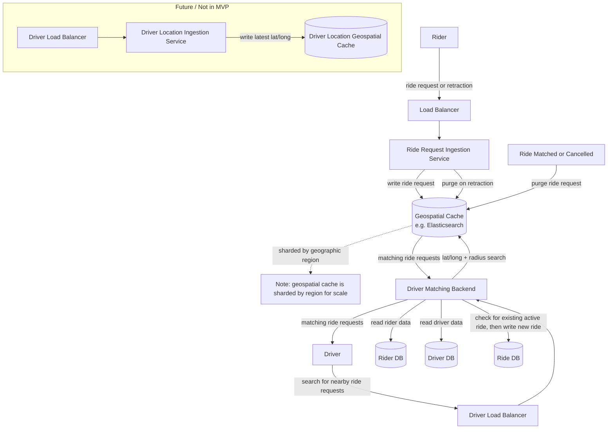

# Decomposition Interview: Ride-Hailing Dispatch System

## Prompt

Design the system that powers a ride-hailing app like Uber/Lyft — specifically
the core loop of a rider requesting a trip and being matched with a driver.

You don't need to solve the whole app. Focus on decomposing the problem:

- What are the core entities/objects in this system?
- What are the major services/components, and what is each one responsible for?
- How do these components communicate (sync/async, APIs, events)?
- Where are the interesting edge cases, race conditions, or failure modes?
- How would this scale, and where are the bottlenecks?

Feel free to sketch diagrams (ASCII is fine), write pseudo-schemas, list
components, or just write prose — whatever helps you think.

---

## Your Answer

## My opening statement

Okay so the first question is what is the problem that I'm trying to solve. Setting aside payments, mapping routes, etc, the basic problem
is really about letting riders share their current location, their desired destination, publishing that information to the driver network, and matching with
a nearby driver. We don't want to allow double matchings (one ride can only get one driver, one driver can only get one rider). We also want to know when a ride is starting,
when it ends, and to make the driver and rider free after it ends.

Does that seem right to you? If so I'll start working through the actual data model and system components that we need here.

## Fleshing out the data model


First is the Rider.

Rider (Db Record)
id, phone-number, name, payment-info, state

RiderState
    inactive
    waiting_for_match,
    matching_waiting_for_pickup,
    in_ride

Driver (Db Record)
id, ...


Rider sends a request to backend
"I want a ride from this location (lat long, the system can use google maps or something to convert that to a street address)"

RiderRequestForRideQuote (ApiRequest)
rider_id, timestamp, start_latlong, dest_latlong

if the rider accepts the quote, then they send out a real request for a ride.

RiderRequestForDrivers (Api request)
rider_id, timestamp, start_latlong, dest_latlong

this actually puts them in waiting_for_match state

now we have to get this information in front of all the relevant drivers. the drivers ultimately should be the ones to accept a ride.

the drivers are polling the app for ride requests. We'll get back to how the app is able to quickly provide a list of these, but assume for now that it can.

DriverRequestForRiders (API Request)
driver_id, current_lat_long, acceptable_destination_geofences, minimum_duration, etc...

Once the driver sees a list of nearby riders waiting for a driver, it accepts one. This sends a request to establish a match

AcceptRideRequestFromDriver (API Request)
driver_id, rider_id, timestamp, start_lat_long, dest_lat_long

this creates a match record

Ride (DB)
rider_id, driver_id, timestamp_matched, start_lat_long, dest_lat_long, end_lat_long, cancelled_timestamp, start_timestamp, end_timestamp


okay, now that I'm looking at this, I don't think the rider actually has a state. I think the rider has a most recent Ride, and depending on the values of that row, we can if the rider
is currently in a rider or matched etc. using a row for this with db transactions also hanlded concurrency problems nicely. you can't create a new row if the most recent one doesn't
have a start or end state for example.


## Corrections and Improvements

Okay so no riderstate, we have Rider and we have Ride.

Let's keep the MVP simple for now

if you have cancelled_timestamp first, then you can't have start_timestamp, and vice versa. let's say there's no mid-ride cancellatoins and we have to do some kind of manual review process
if a ride is a cancelled early. you just estimate price as a fraction of the agreed one, charge the rider, and open a dispute hotline or complaint line or something.
so if the end_lat_long is too different from the dest_lat_long then you have to go through the pro-rated pricing flow, else nothing special happens there. charges and pricing are separate.

RidePayment (Db record)
ride_id, success, full_ride_complete

if you have start_timestamp, then you eventually get an end_timestamp

so as for transactions.

I'm literally imagining you use sql transactions here to handle concurrency. you open a transaction, do a bunch of reads an rides all as part of the match request, and if you get a conflict
then that causes a rollback and an error the user, no ride record is created.

```
pseudo code:
    open transaction
        search for the most recent ride
        if it's done, then you can make another
        else you can't, fail
    close transaction
```

## System Design




