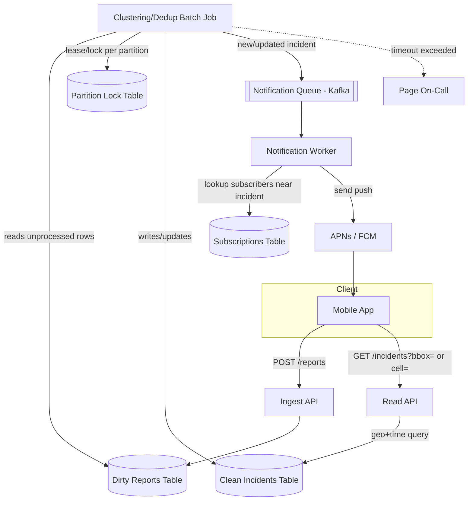
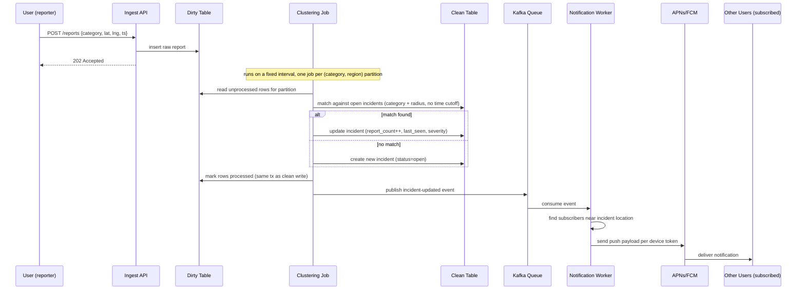
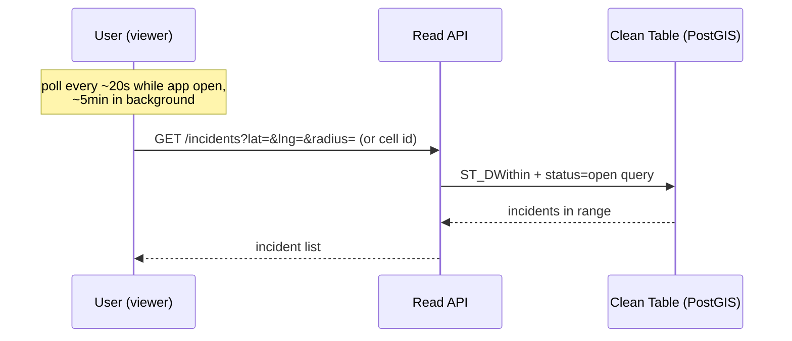

# Citizen App — System Design

## Requirements

- Users submit "something happened near me" reports (category, location, optional media).
- Users see a stream of nearby incidents on a map, both by pulling (map open) and via push (app closed).
- Duplicate reports of the same real-world incident should merge, not spam the map with N markers.
- Abuse/spam resistance (rate limiting, coordinated fake-report detection).
- Old incidents age out; storage shouldn't grow unbounded.

## Architecture



## Report submission -> notification (sequence)



## Read path (map polling)



## Key entities (rough shape, not final schema)

```
reports (dirty, append-only ingest)
  id, user_id, category, lat, lng, media_url, created_at, processed (bool)

incidents (clean, source of truth for reads/notifications)
  id, category, lat, lng, first_seen, last_seen, status (open/closed),
  report_count, severity

subscriptions
  device_token, user_id, area (geo-cell or bounding box), created_at

job_locks
  partition_key (category+region), holder_id, lease_expires_at
```

## Open design decisions still worth stress-testing

- Batch interval / job timeout tuning (currently: target 5 min, page on-call if exceeded).
- Incident "closed" threshold per category (quiet-period before an incident stops matching new reports).
- Coordinated-abuse detection signal (device fingerprint / IP clustering / trust score) — currently unspecified.
- Cold storage / TTL policy for closed incidents.
